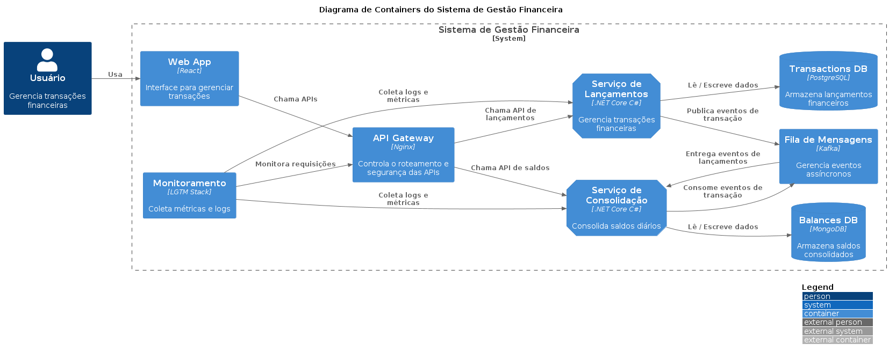

# **Fluxo de Caixa - Arquitetura de Microsserviços**

Este documento é uma proposta de arquitetura para um sistema de **Fluxo de Caixa** de um comerciante. O sistema deve permitir o registro de lançamentos financeiros e a consolidação do saldo diário. A arquitetura proposta é baseada em **Microsserviços** para garantir escalabilidade, resiliência e desempenho.

**Índice de Conteúdos**

* [Mapeamento](#mapeamento)
* [Requisitos](#requisitos)
* [Arquitetura)](#arquitetura)
* [Justificativas](#justificativas)
* [Repositórios](#repositórios)

## Mapeamento

O **fluxo de caixa** do comerciante pode ser dividido em dois principais domínios funcionais:  

### **1. Domínio de Lançamentos (Débitos e Créditos)**  
- Responsável por registrar **entradas e saídas** de dinheiro.  
- Deve garantir **persistência confiável** e suporte a **transações atômicas**.  
- Envolve serviços de **cálculo, categorização e validação** dos lançamentos.

### **Classe: `Transaction` (Transação Financeira)**

| **Campo**      | **Tipo**        | **Descrição**                                  |
|----------------|-----------------|------------------------------------------------|
| `id`           | `Long`          | Identificador único da transação               |
| `description`  | `String`        | Descrição da transação                         |
| `amount`       | `BigDecimal`    | Valor da transação (deve ser positivo)         |
| `type`         | `Type (Enum)`   | Tipo da transação (`DEBIT` ou `CREDIT`)        |
| `date`         | `Instant`       | Data e hora da transação                       |
| `status`       | `Status (Enum)` | Status da transação (`ACTIVE` ou `DELETED`)    |
| `createdAt`    | `Instant`       | Data e hora da criação da transação            |
| `updatedAt`    | `Instant`       | Data e hora da última atualização da transação |

### **Classe: `TransactionAudit` (Auditoria de Transações)**

| **Campo**         | **Tipo**        | **Descrição**                                              |
|-------------------|-----------------|------------------------------------------------------------|
| `id`              | `Long`          | Identificador único da auditoria                           |
| `action`          | `Action (Enum)` | Tipo de ação realizada (`INSERTED`, `MODIFIED`, `DELETED`) |
| `oldDescription`  | `String`        | Descrição anterior da transação                            |
| `oldAmount`       | `BigDecimal`    | Valor anterior da transação                                |
| `oldType`         | `Type (Enum)`   | Tipo anterior da transação (`DEBIT` ou `CREDIT`)           |
| `changeDate`      | `ZonedDateTime` | Data e hora da alteração   

### **2. Domínio de Consolidação Financeira**  
- Responsável por **agregar e calcular** o saldo diário consolidado.  
- Deve garantir **eficiência e escalabilidade**, pois lida com um grande volume de requisições.  
- Pode ter um sistema de **armazenamento otimizado** para consultas rápidas (exemplo: um banco NoSQL para leitura rápida).  

### **Classe: `DailyBalance` (Saldo Diário)**  

| **Campo**      | **Tipo**        | **Descrição**                             |
|----------------|-----------------|-------------------------------------------|
| `id`           | `Long`          | Identificador único do saldo diário       |
| `date`         | `LocalDate`     | Data do saldo (um único registro por dia) |
| `balance`      | `BigDecimal`    | Saldo total consolidado no dia            |
| `createdAt`    | `ZonedDateTime` | Data e hora da criação do registro        |
| `updatedAt`    | `ZonedDateTime` | Data e hora da última atualização         |
***

## Requisitos  

### **Requisitos Funcionais**  
- O sistema deve permitir **cadastro de lançamentos** financeiros.
- Deve existir uma API para **consultar o saldo diário consolidado**.
- Os lançamentos devem ser armazenados com data, tipo (**débito/crédito**), valor e descrição.
- O serviço de consolidação deve calcular automaticamente o saldo diário com base nos lançamentos.
- Deve haver um **relatório** que mostre os saldos diários consolidados.

### **Requisitos Não Funcionais**  
- **Escalabilidade**: Suporte a picos de **50 requisições por segundo** no serviço de consolidação, com até **5% de perda permitida**.
- **Alta Disponibilidade**: O serviço de lançamentos **não pode ser impactado** pela falha no serviço de consolidação.
- **Resiliência**: O sistema deve ter **estratégias de failover e redundância** para evitar downtime.
- **Segurança**:  
  - Autenticação e autorização para acessar os serviços.  
- **Monitoramento e Observabilidade**: Logs estruturados e métricas de uso para acompanhar o desempenho.
***

## Arquitetura Alvo

A arquitetura proposta segue um modelo de **Microsserviços** para garantir **desempenho, escalabilidade e resiliência**.  

### **Componentes Principais**  
🔸**API Gateway**  
- Centraliza as requisições e roteia para os serviços corretos.  
- Garante segurança e balanceamento de carga.  

🔸**Serviço de Lançamentos**  
- Responsável por registrar, armazenar e gerenciar os lançamentos.  
- Banco de dados **relacional (PostgreSQL)** para consistência.  
- Exposição de APIs REST para interagir com os lançamentos.  

🔸**Serviço de Consolidação**  
- Processa e armazena o saldo diário consolidado.  
- Banco de dados **NoSQL (MongoDB)** para consultas rápidas.  

🔸**Fila de Mensagens (Kafka)**  
- Garante a comunicação assíncrona entre os serviços.
- Se o serviço de consolidação cair, os eventos de lançamentos são armazenados na fila e processados posteriormente.  

🔸**Monitoramento e Logging**  
- **Open Telemetry** para rastreamento de requisições e métricas de desempenho.
- **LGTM Stack** (Loki, Grafana, Tempo, Mimir) para monitoramento e análise de logs.

***

## Justificativas 

### **1️⃣ Microsserviços vs Monolito**  
✔ **Microsserviços** permitem maior **escalabilidade e resiliência**.  
✔ Serviços podem ser desenvolvidos e escalados **independentemente**.  
✔ Isolamento de falhas: o **Serviço de Lançamentos continua operando** mesmo se o **Serviço de Consolidação falhar**.  

**Por que não Monolito?**  
🚫 Mais difícil de escalar  
🚫 Tempo de resposta maior em alto volume de requisições  

### **2️⃣ Tecnologias Escolhidas**  

| Tecnologia              | Justificativa                                              |
|-------------------------|------------------------------------------------------------|
| **React**               | Framework popular e eficiente para interfaces de usuário   |
| **C# .NET Core**        | Linguagem robusta e eficiente para desenvolvimento de APIs |
| **PostgreSQL**          | Banco de dados relacional para garantir consistência       |
| **MongoDB**             | Banco de dados NoSQL para consultas rápidas                |
| **Kafka**               | Fila de mensagens escalável e tolerante a falhas           |
| **LGTM Stack**          | Monitoramento e análise de logs eficientes                 |
| **Docker + Kubernetes** | Orquestração para escalabilidade automática                |
***

## Repositórios

* [Transaction API .NET Core](https://github.com/jtsato/fms-transaction-api-netcore)
* [Balance API .NET Core](https://github.com/jtsato/fms-balance-api-netcore)

***